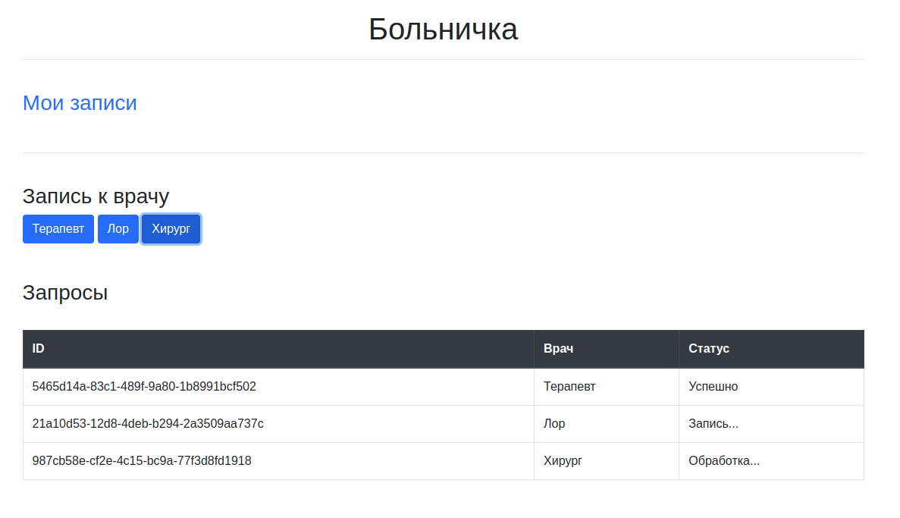
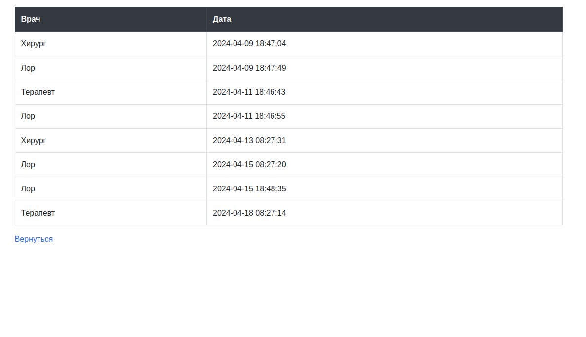

# FastAPI + Celery + Redis

Мы не молодеем, появляются новые болячки. Пора бы уже наконец сходить в больничку к терапевту.




И так, по нажатию одной из кнопок, обозначающих врачей, `JS` посылает `POST` запрос на создание записи
к врачу, которая отдается на выполнение `Celery`. Задача имитирует выполнение долгой операции через несколько `time.sleep(10)`
и меняет состояние на кастомные "Обработка...", "Запись..." и "Успешно". 

Помимо этого, таска создает рандомную дату для записи и сохраняет запись в БД. Я решил использовать `Redis`, т.к. ни разу с ним не работал и он был уже доступен, потому что
использовался в качестве брокера.

* Блок **Запросы** 
Представляет из себя динамическую таблицу. Каждые две секунды `JS` кидает `GET` запрос
для определения статуса выполняемой таски. Как только он получает статус "Успешно" или "FAILURE", он перестает это делать.


* Страница **Мои записи** 
Показывает врачей, на которых пользователь записан, и дату посещения. Сервер как раз таки получает
все записи из `Redis`.

## Запуск

Все приложение упаковано в Docker, поэтому запускать просто:
```shell
docker-compose up --build
```
Осталось перейти на http://0.0.0.0:8000 и готово!

Запуск тестов происходит только в docker'e (запущенном).

```shell
docker-compose exec -T server pytest
```
